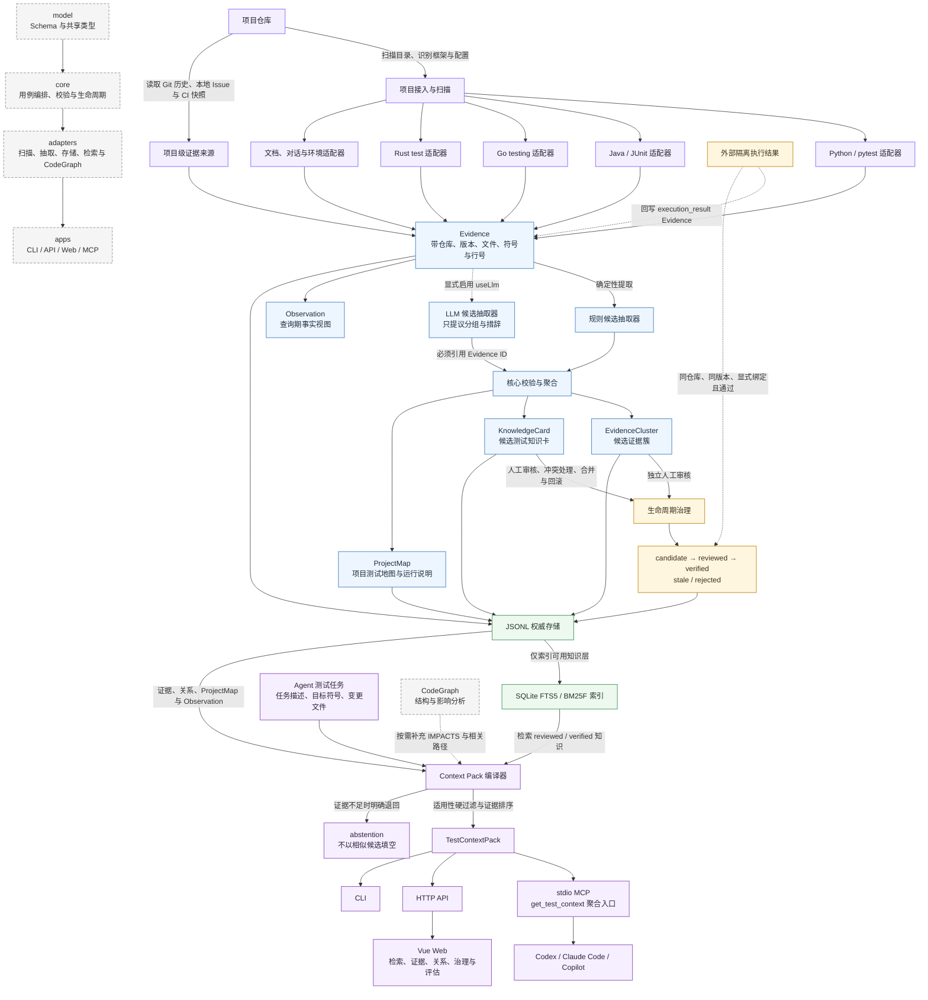

# TestKnowledge 项目架构图

> 本图依据当前仓库实现整理，采用“入口 → 核心链路 → 数据资产 → 消费端”的自上而下结构。灰色连线文字说明数据如何流转；虚线表示按需或外部协作，不代表默认执行。

## 如何读这张图

- **Evidence 是共同底座**：测试源码、配置、Git 历史和显式导入的外部快照先变成带出处的证据，不直接变成已验证知识。
- **规则与 LLM 的权限不同**：规则抽取默认运行；LLM 只有显式启用时才参与，并且输出仍是必须经过核心校验与人工审核的候选。
- **Observation 与 KnowledgeCard 分层**：Observation 是查询时展示的事实视图；只有经过治理的知识卡才进入知识检索层。
- **JSONL 与 SQLite 分工明确**：JSONL 保存权威资产和治理记录，SQLite 只负责对可用知识建立检索索引。
- **CodeGraph 负责结构，TestKnowledge 负责测试经验**：CodeGraph 按需提供调用与影响范围；fixture、mock、边界、Oracle、回归经验和运行说明由测试知识资产提供。
- **Context Pack 是统一输出**：CLI、HTTP、Web 和 MCP 共享同一个核心与组合根，不各自复制知识逻辑。

## 当前能力边界

- MCP 服务只提供知识上下文与治理入口，不在仓库内自动执行测试。
- `verified` 必须来自 `reviewed`，并引用同仓库、同版本、显式绑定且通过的外部执行证据。
- Issue / CI 当前通过本地快照接入，尚未直接连接外部平台。
- 跨仓库、跨框架和跨语言知识迁移，以及仓库内受控隔离执行器，仍不属于当前已实现主链路。
